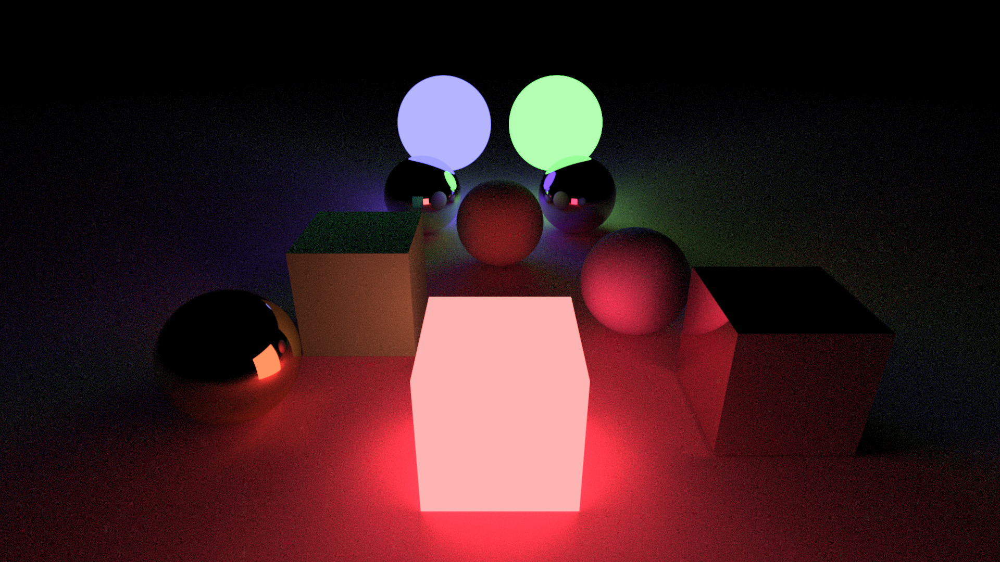

# Ray Tracing Renders with different Material and Object combinations.

### Primitive Objects: 
  - Sphere
  - Box (Quadrangular)

### Materials: 
  - Lambertian
  - Metal
  - Light Source
  - Dielectric

### Features: 
  - Anti-Aliasing (Supersampling: Grid Algorithm)

For a higher quality version, [click here](Renders/Task%207.ppm).

